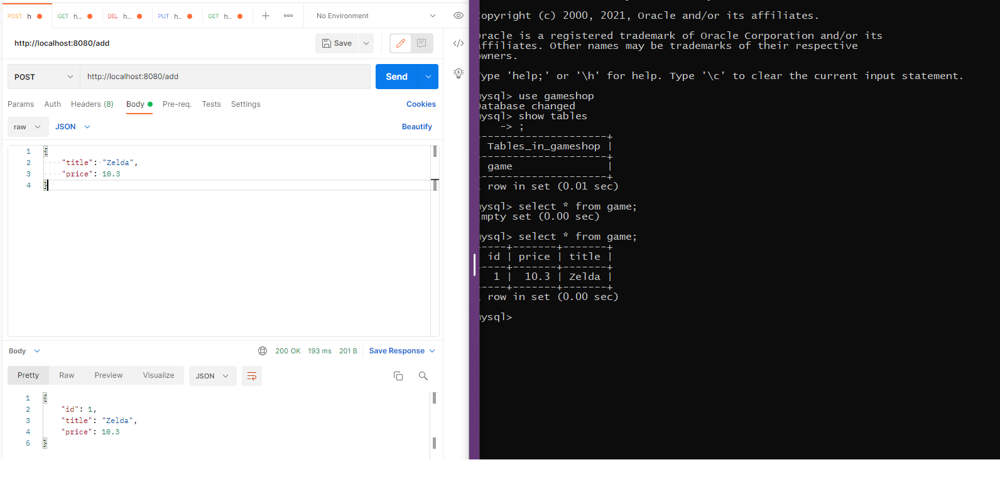
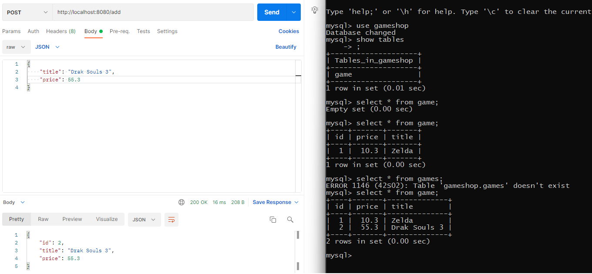
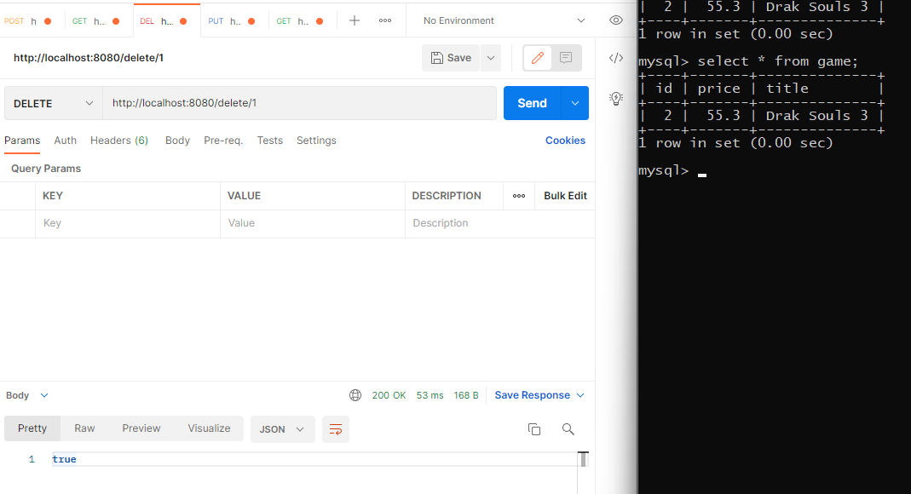
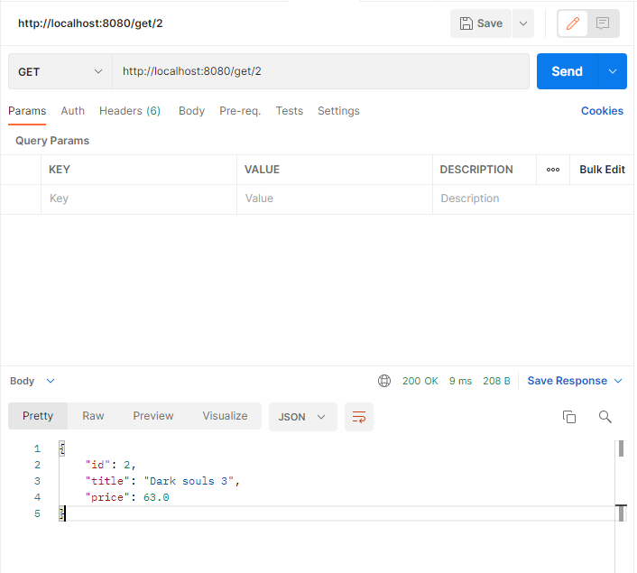
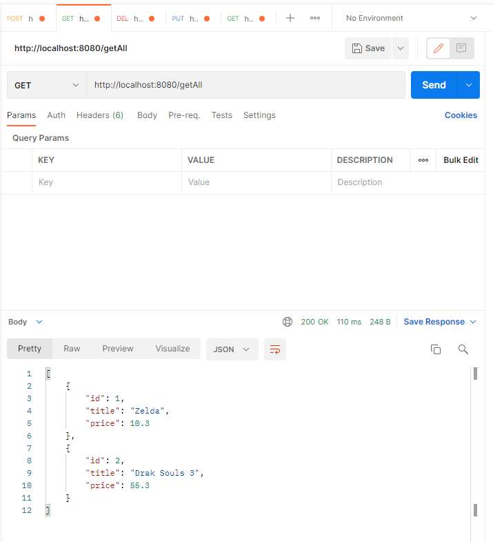
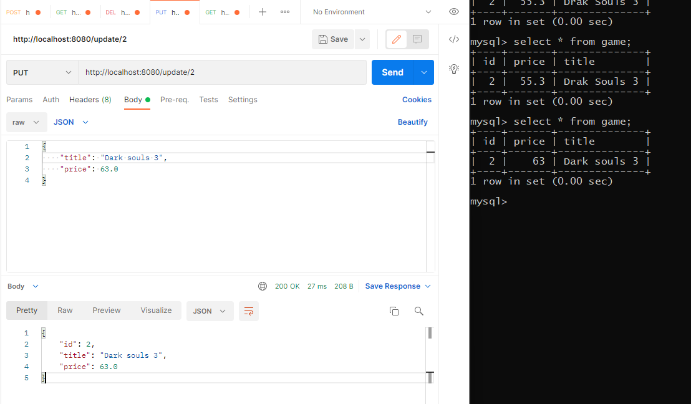
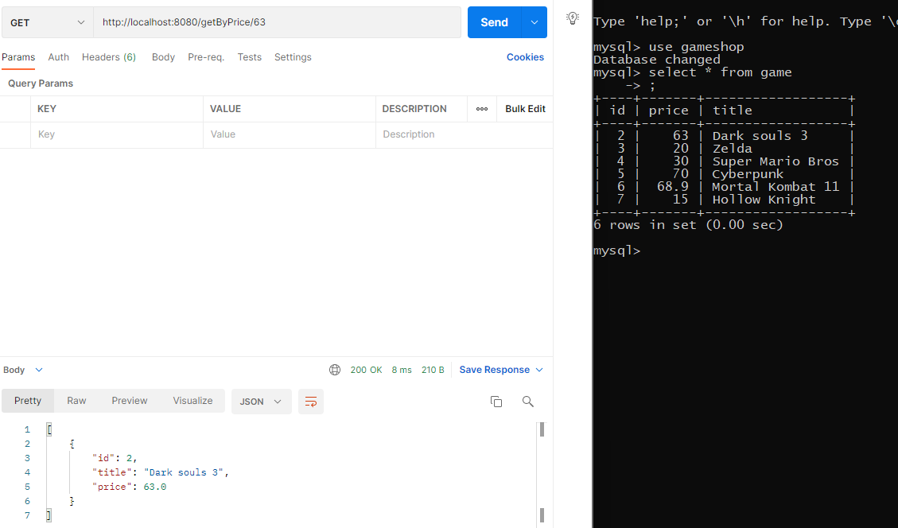
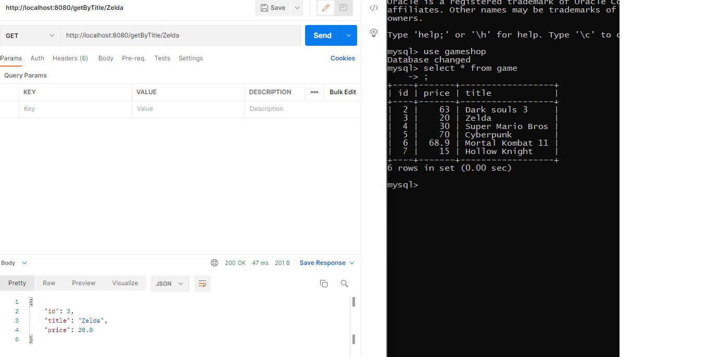

# Why am I doing this?
This is a project I was set to do by the trainers in the bootcamp I started in the summer of 2021
# How I expect this challenge to go?
I expect it to go well as I will not be doing anything that I have not done before.
# What went well? What didn't go as planned?
Custom queries, I attempeted to use JPQL but I was unable to, I kept getting errors and exceptions so I just used SQL.
Prepopulating the database caused me to waste a lot of time due to unexpected exceptions.
Testing, a lot of unexpected errors and exceptions.
Everything else went really well.
# Possible improvements
Sending a float in a Http request doesn't work, what I could do is @requestbody in json format.
Adding more entities and custom queries for more specific requests.
Adding more detail to my current Entity Game.java.
# Screenshots

# Link to Jira
https://disuqi.atlassian.net/jira/software/projects/GAM/boards/2